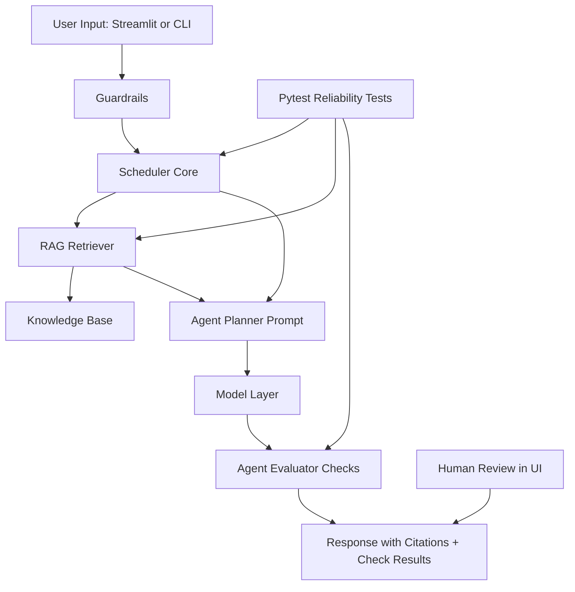

# PawPal+ AI Reliability Planner

PawPal+ AI Reliability Planner is an expanded version of the PawPal starter project. It keeps the original pet-care scheduling system (owner, pets, tasks, recurrence, conflicts, and time-budget planning) and adds integrated AI behavior using Retrieval-Augmented Generation (RAG), an agentic plan-act-check workflow, and built-in reliability checks.

This matters because pet-care planning is a safety-sensitive use case: the assistant should not only produce a schedule, it should justify priorities with retrieved evidence and report whether its response passes quality checks.

## Original Project (Modules 1-3)

Original project name: **PawPal+ (Module 2 Project)**.

The original system focused on task management and rule-based scheduling for pet owners. It allowed users to add pets and tasks, generate daily schedules, detect time conflicts, and handle recurring tasks. It also included tests for core scheduling reliability and persistence.

## What Is New in This Version

- Integrated **RAG**: the assistant retrieves relevant care guidance from a local knowledge base before generating recommendations.
- Integrated **Agentic Workflow**: each request follows plan -> retrieve -> act -> evaluate.
- Integrated **Reliability Checks**: each response reports checks such as length, grounding to top scheduled task, and retrieval reference detection.
- Guardrails and logging: unsafe or malformed requests are blocked and logged.

## Architecture Overview

The system has these components:

- Input layer: Streamlit UI and CLI.
- Scheduler core: inherited and extended from the starter logic.
- Retriever: lexical retrieval over local knowledge chunks.
- Agent: composes plan + schedule + retrieved context and generates an answer.
- Evaluator: validates response quality/grounding tags.
- Human review: user sees output, citations, and checks in the app.

Mermaid source is in [docs/architecture.mmd](docs/architecture.mmd).



## Setup Instructions

1. Create and activate a virtual environment:

```bash
python -m venv .venv
.venv\Scripts\activate
```

2. Install dependencies:

```bash
pip install -r requirements.txt
```

3. Choose model mode:

- Default reproducible mode: `PAWPAL_MODEL_PROVIDER=rule-based`
- Optional live model mode: `PAWPAL_MODEL_PROVIDER=openai` and set `OPENAI_API_KEY`

You can copy values from [.env.example](.env.example).

4. Run CLI demo:

```bash
python main.py
```

5. Run Streamlit app:

```bash
streamlit run app.py
```

6. Run tests:

```bash
python -m pytest
```

7. Run the evaluation harness:

```bash
python scripts/eval_harness.py
```

## Sample Interactions

### Example 1: Medication-first planning

Input:

`Plan today with medication first and explain tradeoffs.`

Output (rule-based model):

`1. Review today's tasks sorted by priority and time.
2. Allocate tasks that fit the daily time budget.
3. Insert medication and feeding tasks first.
4. Add enrichment tasks in remaining open slots.
5. Return a concise schedule and explain why each task appears.`

Citations:

`kb-001, kb-004, kb-005`

Checks:

`quality:length_ok, grounding:mentions_top_task, grounding:mentions_retrieval`

### Example 2: Conflict handling

Input:

`Two high-priority tasks overlap at 08:00. What should I do?`

Output (representative):

`Keep Medication at 08:00 and move lower-risk tasks to the next available slot. Preserve feeding and medication order before optional play tasks.`

Citations:

`kb-004, kb-001`

### Example 3: Enrichment under time limit

Input:

`I only have 60 minutes today. Include one enrichment task if possible.`

Output (representative):

`Schedule Breakfast and Medication first, then include Puzzle toy play if remaining minutes permit.`

Citations:

`kb-003, kb-001`

## Design Decisions and Trade-offs

- Kept the original object model (Owner, Pet, Task, Scheduler) to preserve starter project continuity.
- Used lightweight lexical retrieval rather than embeddings to keep setup simple and fully local.
- Added deterministic model fallback so the app runs reproducibly without external API keys.
- Trade-off: lexical retrieval is easier to run but less semantically robust than vector retrieval.
- Trade-off: evaluator checks are transparent and testable but not as rich as LLM-based graders.

## Demo Walkthrough

Add your Loom walkthrough link here after recording an end-to-end demo:

- Loom video: TODO - replace with your link

Suggested demo flow:

1. Show app startup and owner/pet/task setup.
2. Run at least 2-3 AI prompts in the Streamlit app.
3. Highlight citations and reliability checks for each output.
4. Run `python -m pytest` and briefly show green test output.

## Reliability and Evaluation

This project includes multiple reliability layers:

- Automated tests (unit/integration): validates scheduler logic, retrieval relevance, and end-to-end agent outputs.
- Structured reliability checks: every AI response includes tags such as `quality:length_ok`, `grounding:mentions_top_task`, and `grounding:mentions_retrieval`.
- Logging and error handling: guardrails block unsafe/invalid input and log reasons.
- Human evaluation: users review output quality, citations, and checks in the Streamlit interface.

Latest measurable results:

- 5 out of 5 automated tests passed.
- In the latest CLI run, 3 out of 3 reliability checks passed for the demo query.
- Evaluation harness: 4 out of 4 predefined cases passed.
- Evaluation harness confidence score: average 0.83.
- Reliability improved after adding explicit grounded top-task text in agent responses.

Known failure modes:

- Lexical retrieval can underperform when user wording has little token overlap with knowledge chunks.
- Rule-based fallback can produce repetitive language for broad, open-ended prompts.

## Reflection and Ethics

### Limitations and Biases

- The knowledge base is small and manually authored, so guidance may be incomplete.
- Retrieval quality is tied to wording overlap, which can bias the system toward explicit keyword phrasing.
- Rule-based fallback style may over-prioritize deterministic structure over nuanced context.

### Misuse Risks and Mitigations

- Potential misuse: asking harmful pet-care guidance or unsafe instructions.
- Mitigation: query guardrails block unsafe terms and return a safe failure response.
- Additional mitigation used in design: responses are grounded with citations to make recommendations auditable.

### Reliability Surprise During Testing

- A key surprise was that a response could look coherent but still fail grounding checks.
- After enforcing explicit top-task grounding text, reliability checks became more consistently meaningful.

### Collaboration with AI During This Project

- Helpful suggestion: AI-assisted decomposition into a plan -> retrieve -> act -> evaluate pipeline made architecture cleaner and easier to test.
- Flawed suggestion: an earlier default response path did not always mention the top scheduled task, causing a grounding miss; this was corrected by appending grounded task context in the agent output.

See additional required reflection details in model_card.md.

## Portfolio Artifact Reflection

This project shows me as an AI engineer who values reliability and transparency over flashy outputs. I designed a system where model responses are grounded with retrieval evidence, evaluated with explicit checks, and supported by reproducible testing and guardrails. My engineering focus is building AI systems that can be audited, debugged, and trusted in practical workflows.

## Submission Checklist

Use this checklist before submission:

- [ ] Code pushed to the correct GitHub repository.
- [ ] Repository is public.
- [x] Required functional code present.
- [x] Comprehensive README.md present.
- [x] model_card.md present.
- [x] System architecture diagram included (README and docs/architecture.mmd).
- [x] Organized assets folder present.
- [ ] Commit history shows multiple meaningful commits.
- [ ] Standardized documentation finalized (base project + reflections + testing results).
- [ ] Demo walkthrough link added (Loom/GIF/screenshots with 2-3 interactions).
- [ ] Final changes committed and pushed before deadline.
